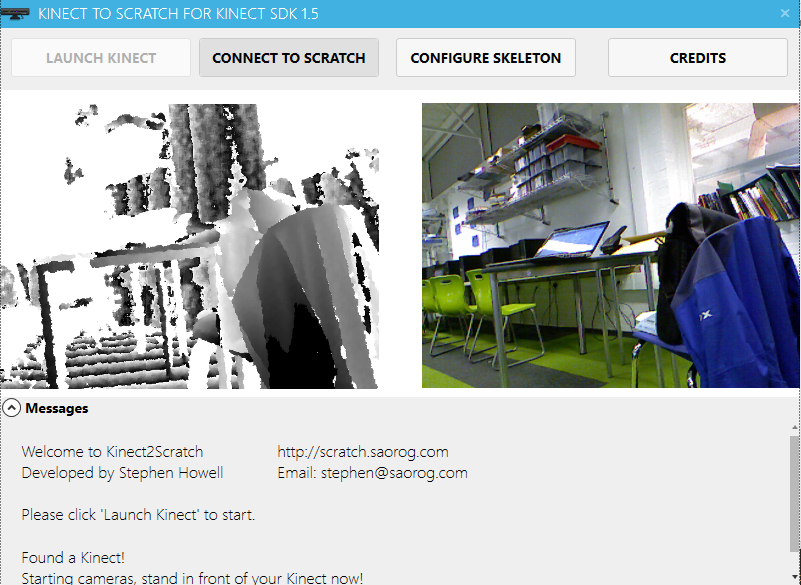
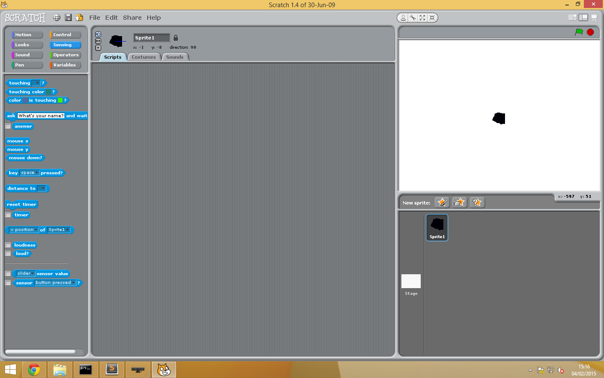
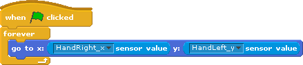

# Kinect Course

## Part 1: Writing a simple program in Scratch

### Setting Up

To get the Kinect sensor up and running, you will need 2 programs installed on your computer, these are [Scratch itself](http://scratch.mit.edu/scratch_1.4/) (obviously) and a tool called [Kinect2Scratch](http://scratch.saorog.com/). The both should be installed already, but if not just click the links to download them. 

To start off, connect the sensor to your computer (make sure both the USB cable and the power socket are plugged in) and fire up Kinect2Scratch. Once the window has loaded, click on the 'Launch Kinect' button. It should look something like this: 

   

*By the way, if the program seems to crash without explanation, it is probably because the Kinect isn't properly connected. Check all of the wires and try again.*

The Kinect sensor has two cameras, one which detects visible light like our eyes (the image on the right), and another which can see the distance of objects from it. This depth sensor is the image you can see on the left - the colours correspond to different differences an object may be from the sensor. Finally, click on the button marked 'Connect to Scratch'. 

Open up Scratch and create a new project. By default, Scratch does not accept input from the Kinect, so you must go through a simple, albeit slightly convoluted, process to enable it. Click on the 'sensing' tab in the leftmost sidebar, and find the block marked 'Slider Sensor Value' (it should be second from the bottom). Instead of dragging it into the code area, right click on it and select 'Enable Remote Sensor Connections'. A confirmation box should pop up, and the Windows Firewall may ask for special permissions for Scratch. If it does, just click on 'Accept'. From this point, you should be able to start hacking the Kinect with Scratch.

### The simple (yet amazing) Moving Blob

In order to get to grips with some of the basic principles of using the Kinect, the first program we are going to make will be a sprite which follows the relative position of the user's hand around the screen. Create a new sprite, and paint a beautiful blob (or a beautiful ostrich, or a beautiful anything, really...) 
It may look something like this:

   

Now for the code. Instead of attempting, and probably failing horribly, to describe it in words, I will insert a screenshot of the code for each example; try to copy it into the project yourself. The code for the blob should look like this: 

   

When run, this code forms an infinite loop, and each time moves the sprite to the corresponding x and y coordinates from the Kinect. The sprite will not move unless it is explicitly told to, so the code must kepp moving the blob to the correct position so that it keeps tracking the user's hand. 

__Exercise: Try adding another sprite to the project, which tracks the user's left hand. If you get stuck, have a look at the example code [here](./examples/part1.sb).__

## Part 2: Tracking Multiple Joints

By looking through the values that are available in Scratch, you should be able to notice that the parts of the body which are tracked by the Kinect are the joints, for example the elbows, shoulders and knees. By joining up these points, it is possible to visualise the entire skeleton of a person, as seen by the Kinect. 

## Part 3: A lovely game

Eg. pong, the best game :)

## Part 4: C# basics

Make a helloworld c# app; terminal/winforms/wpf?

## Part 5: Making the Kinect work with C#

Make the moving blob and stickman etc. in C#

## Part 6: Making a Kinect program

Something more complex in C#, eg. a stickman or game or something?